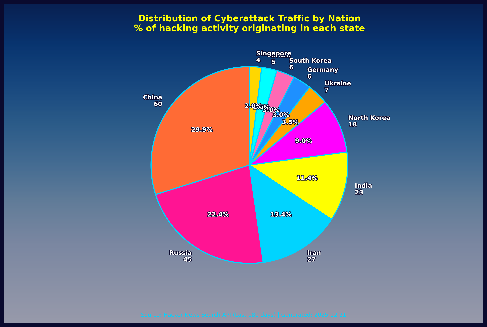

<div align="center">


<h1>S-O-U-R-C-E</h1>

<p align="center">
  <a href="https://github.com/OpenSource-For-Freedom/SOURCE/actions/workflows/update-badip.yml">
    
  </a>
<a href="https://github.com/OpenSource-For-Freedom/source/actions">
  
</a>
<a href="https://www.python.org/downloads/release/python-3140/">
  
</a>
<a href="https://hits.dwyl.com/OpenSource-For-Freedom/source">
  
</a>
</p>

<em>Automatically updated malicious IP database with geolocation mapping and threat analysis.</em>

<p><strong>Data updated every Sunday at midnight UTC.</strong></p>

## Resources
- Curl this to capture the bad ip file
```
curl -sS https://raw.githubusercontent.com/OpenSource-For-Freedom/SOURCE/main/badip_list.csv
```

## Database Statistics

| Metric | Value |
|---|---|
| Total Malicious IPs | 261,872 |
| Countries Affected | 219 |
| Average Threat Severity | 3.00/5 |
| Last Updated | 2025-12-21 02:41:52 UTC |

## Top Countries

| Country | IPs |
|---|---|
| CN | 51666 |
| US | 41012 |
| IN | 13805 |
| RU | 10292 |
| NL | 9398 |
| TH | 8445 |
| BR | 7972 |
| DE | 7254 |
| SG | 5978 |
| KR | 5692 |

---

## Global Threat Distribution

<div align="center">


</div>


---

## Cyber Attack Attribution (Hacker News)

<div align="center">



</div>

</div>

## Cyber Attack Origins


## Wall of Shame
| IP | Domain/Host | Severity | Threats |
|---|---|---|---|
| 83.219.248.37 | AS41745 | 3/5 | 28 |
| 179.43.184.242 | hostedby.privatelayer.com. | 3/5 | 26 |
| 114.111.54.188 | AS54994 | 3/5 | 26 |
| 45.148.10.121 | AS48090 | 3/5 | 26 |
| 80.94.92.182 | AS47890 | 3/5 | 26 |
| 80.94.92.186 | AS47890 | 3/5 | 26 |
| 129.45.84.93 | host-93.84.45.129.djezzycloud.dz. | 3/5 | 26 |
| 143.20.185.79 | AS214209 | 3/5 | 26 |
| 45.93.168.13 | 45-93-168-13.digiturunc.com. | 3/5 | 26 |
| 61.245.11.87 | AS19970 | 3/5 | 26 |
| 62.60.131.157 | AS208137 | 3/5 | 26 |
| 64.227.97.118 | AS14061 | 3/5 | 26 |
| 66.132.153.113 | AS398324 | 3/5 | 26 |
| 66.132.153.115 | AS398324 | 3/5 | 26 |
| 66.132.153.123 | AS398324 | 3/5 | 26 |
| 66.132.153.127 | AS398324 | 3/5 | 26 |
| 66.240.192.138 | census8.shodan.io. | 3/5 | 26 |
| 71.6.165.200 | census12.shodan.io. | 3/5 | 26 |
| 71.6.199.23 | einstein.census.shodan.io. | 3/5 | 26 |
| 80.82.77.33 | sky.census.shodan.io. | 3/5 | 26 |


# Overview
- This is an "API-KEY-LESS" repo.
- Uses open-source data to collect known malicious IPs and geolocate them with Python.
- Clone this repo to obtain actively updated data to help secure your infrastructure.
- Source of truth: [Bad IP List](/badip_list.csv) is updated weekly; images and charts are regenerated on the same cadence.

## Documentation

- **[Overview.md](docs/OVERVIEW.md)** - General Overview of repository function
- **[API.md](docs/API.md)** - Database schema and query examples
- **[Database.md](docs/DB.md)** - Database design, included files and pipeline


---
**Data Sources**: [Stamparm/Ipsum](https://github.com/stamparm/ipsum) |[Hacker News](https://thehackernews.com/) | [Google Safe Browsing](https://developers.google.com/safe-browsing) | [Google Transparency Report](https://transparencyreport.google.com/) | **Last Generated**: 2025-12-21 02:41:52 UTC
</div>

