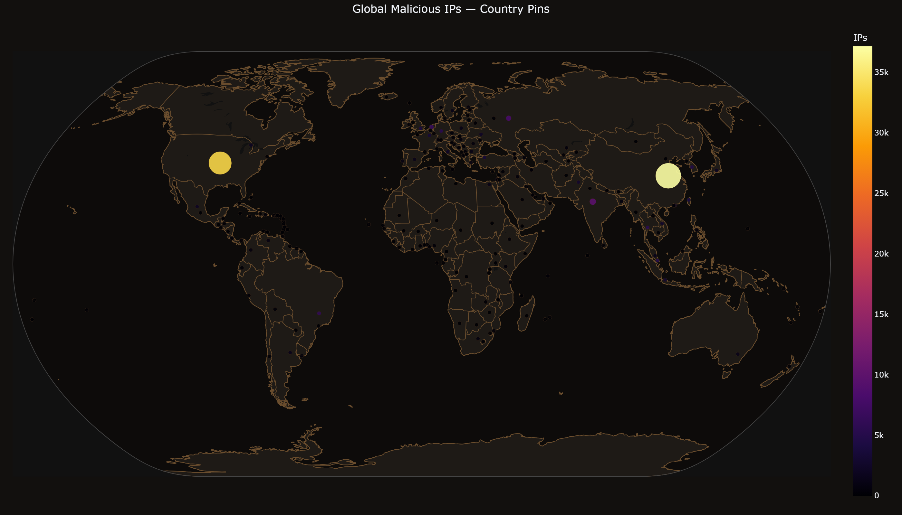
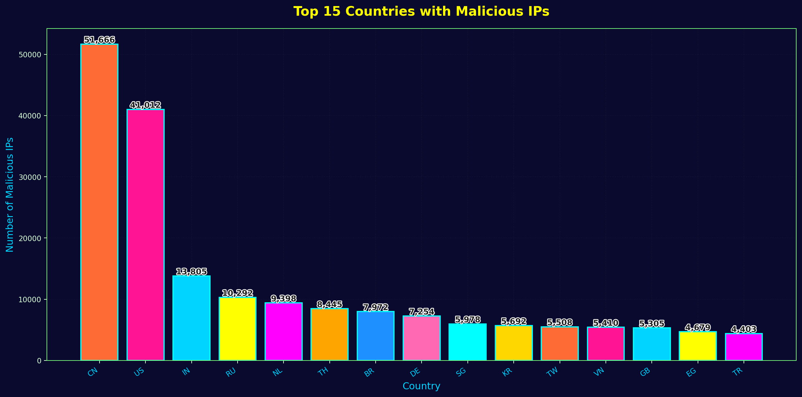
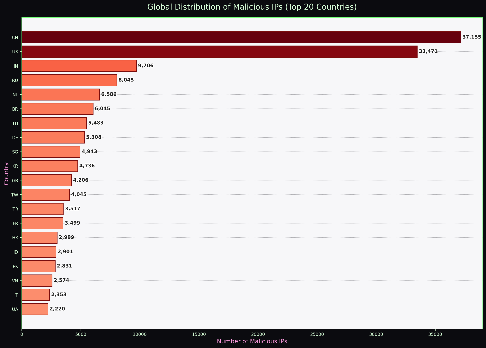

<h1>S-O-U-R-C-E</h1>

  
  
  
  

<em>Automatically updated malicious IP database with geolocation mapping and threat analysis.</em>

<strong>Data updated every Sunday at midnight UTC.</strong>

---

# Overview
- This is an "API-KEY-LESS" repo.
- Uses open-source data to collect known malicious IPs and geolocate them with Python.
- Clone this repo to obtain actively updated data to help secure your infrastructure.
- Source of truth: [Bad IP List](/badip_list.csv) is updated weekly; images and charts are regenerated on the same cadence.

## Database Statistics

- **Total Malicious IPs**: 212,137
- **Countries Affected**: 213
- **Average Threat Severity**: 3.00/5
- **Last Updated**: 2025-12-17 22:32:11 UTC

## Global Threat Distribution

## Why you need to ban IP's 

In short, an auto-generating curated banned‑IP list blocks known malicious hosts early, reducing noise, load, and risk with minimal effort. It complements IDS/WAFs and speeds up mitigation.

## Dive in

- Cloud
    - One central list can be pushed to many instances, edge services, and CDNs for fast, consistent protection.
    - Scales with autoscaling and integrates with cloud firewalls and edge ACLs.

- On‑prem
    - Enforces blocking at your network edge or appliances to prevent unwanted traffic from entering your environment.
    - Works offline and gives tighter control over routing, segmentation, and critical allow‑lists.

A cooked and taste tested banned IP list reduces risk by proactively blocking known malicious hosts before they reach services or users. It complements signature and behavioral controls by providing deterministic, low‑cost filtering that scales across environments.

**Key benefits**
- Reduces attack surface: drops connections from known bad actors early, lowering load on IDS/IPS, application stacks, and logging pipelines.
- Lowers MTTM: blocks repeat offenders immediately without per‑incident remediation.
- Improves telemetry/network quality: fewer noisy or malicious flows means clearer analytics and alerting for real threats (limiting their footprint in a good way)
- Enforces consistency: shared lists ensure uniform blocking policies across cloud regions and on‑prem clusters.

**Cloud vs on‑prem considerations**
- Cloud
    - Centralized distribution: one list propagated to many ephemeral instances and regions.
    - Rapid scale: protects autoscaled workloads and edge services with minimal latency when integrated into edge ACLs or cloud firewall rules.
    - Integration: pairs well with CDN/edge providers and WAFs for upstream mitigation.
- On‑prem
    - Local enforcement: blocks at network edge or appliance to avoid unnecessary upstream traffic and reduce egress cost.
    - Offline resilience: retains protection when cloud services or external lookups are unavailable.
    - Network topology: more control over granular routing, VLANs, and internal segmentation using a local list.

**Ops best practices**
- Automate updates and validation (CI/CD) with signed or versioned lists.
- Apply tiered blocking ( or denylist vs watchlist) to reduce false positives.
- Distribute lists in both human‑readable (CSV/JSON) and optimized formats for faster lookups.
- Monitor effectiveness and tune using feedback loops from logs, honeypots, and threat intelligence.
- Combine with rate limiting and anomaly detection for `DidS` defense in depth as a service.
- Test rollback and allow‑listing for critical assets to prevent accidental service disruption.

## Overview
- This is an "API-KEY-LESS" repo.
- Uses open-source data to collect known malicious IPs and geolocate them with Python.
- Clone this repo to obtain actively updated data to help secure your infrastructure.
- Source of truth: [Bad IP List](/badip_list.csv) is updated weekly; images and charts are regenerated on the same cadence.

## Pipeline

- **Fetch script:** [scripts/fetch_blacklists.py](scripts/fetch_blacklists.py) — fetch-only; writes per-source CSVs into the `data/` folder (produces `data/fetched_ips.csv` and `data/new_ips.csv`) and does NOT modify `badip_list.csv` or the database.
- **Processor:** [scripts/process_badips.py](scripts/process_badips.py) — ingests all CSVs under `data/`, deduplicates and normalizes records, updates the canonical [badip_list.csv](badip_list.csv), and writes `data/badips.db`; also performs geolocation/ASN enrichment and generates charts.
- **CI orchestration:** [.github/workflows/update-badip.yml](.github/workflows/update-badip.yml) — runs the fetcher, then the processor, then `scripts/generate_visualizations.py`, and commits the updated artifacts back to the repo (uses GitHub Actions secrets where needed).

## Database overview

### How database files feed badips.db and .mmdb

- badip_list.csv (source-of-truth)
    - Master CSV containing rows for each malicious IP (ip, first_seen, last_seen, severity, source_feed, asn, asn_org, country_code, city, latitude, longitude, notes).
    - Updated weekly by CI; used as the single canonical input for all downstream artifacts.

- Enrichment/cache files (intermediate)
    - Temporary JSON/Parquet/CSV files produced during enrichment (geo lookups, ASN resolution, reverse DNS, threat scoring).
    - Persisted to avoid repeated external lookups and to provide reproducible builds.

- badips.db (SQLite)
    - Built from badip_list.csv + enrichment data.
    - Normalized tables (ips, asns, sources) and indexes on ip, last_seen, severity for fast analytic queries and joins.
    - Primary runtime store for dashboards, CI checks, exports, and programmatic queries.

- badips.mmdb (MaxMind DB)
    - Generated from badip_list.csv + geolocation fields via an mmdb writer (e.g., libmaxminddb/mmdbwriter).
    - Schema maps IP -> {is_malicious: true, severity, first_seen, last_seen, source, asn, asn_org, country, city, latitude, longitude}.
    - Optimized for low-latency binary lookups by services (GeoIP2-compatible consumers, edge proxies, appliances).

- Exports and consumers
    - Blocklists (plain IP/CIDR), JSON/GeoJSON, CSV exports and the .mmdb are produced from badips.db or directly from the canonical CSV.
    - SIEM enrichment jobs and automation read badips.db for joins; network appliances read the .mmdb for fast IP tagging.

- CI pipeline
    - CI: ingest feeds -> normalize -> enrich -> write badip_list.csv -> build badips.db -> build badips.mmdb -> generate charts/exports -> publish artifacts.
    - Each step adds structure (DB tables, MMDB keys) tailored to consumer performance and query patterns.

## Database Statistics

- **Total Malicious IPs**: 192,605
- **Countries Affected**: 213
- **Average Threat Severity**: 3.00/5
- **Last Updated**: 2025-12-17 20:11:36 UTC

- **Total Malicious IPs**: 212,137
- **Countries Affected**: 213
- **Average Threat Severity**: 3.00/5
- **Last Updated**: 2025-12-17 22:32:11 UTC

---

## Detailed Views

## Documentation

- **[API.md](API.md)** - Database schema and query examples

---
**Data Sources**: [Stamparm/Ipsum](https://github.com/stamparm/ipsum) | [Google Safe Browsing](https://developers.google.com/safe-browsing) | [Google Transparency Report](https://transparencyreport.google.com/) | **Last Generated**: 2025-12-17 20:11:36 UTC

