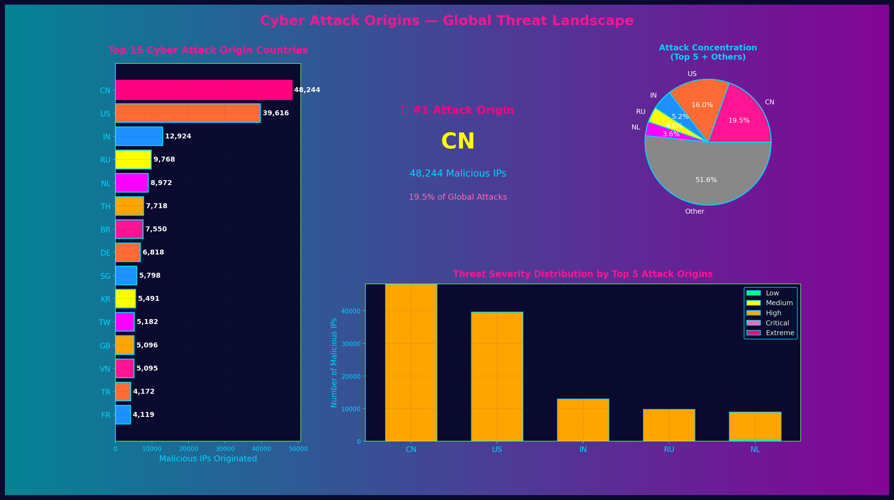

<div align="center">


<p align="center">
  <a href="https://github.com/OpenSource-For-Freedom/SOURCE/actions/workflows/update-badip.yml">
    
  </a>
<a href="https://github.com/OpenSource-For-Freedom/source/actions">
  
</a>
<a href="https://www.python.org/downloads/release/python-3140/">
  
</a>
<a href="https://hits.dwyl.com/OpenSource-For-Freedom/source">
  
</a>
</p>

# SOURCE — Malicious IP Intelligence Feed

**Threat intelligence for network defense.**  
SOURCE provides regularly updated malicious IP data with geolocation, ASN enrichment, and severity scoring. It's designed for security teams, SOCs, and infrastructure automation.

**Download • Query • Visualize**

---

## Quickstart

### Option A: Download CSV
```bash
curl -sS https://raw.githubusercontent.com/OpenSource-For-Freedom/SOURCE/main/badip_list.csv -o badip_list.csv
```

### Option B: Query SQLite Database
```bash
# Download the database
curl -sS https://raw.githubusercontent.com/OpenSource-For-Freedom/SOURCE/main/data/badips.db -o badips.db

# Query high-severity threats from specific country
sqlite3 badips.db "SELECT ip_address, severity, threat_count FROM bad_ips WHERE severity >= 4 LIMIT 10;"
```

### Option C: Python Integration
```python
import pandas as pd

# Load and filter the dataset
df = pd.read_csv('badip_list.csv')
high_severity = df[df['severity'] >= 4]
print(f"Found {len(high_severity)} high-severity IPs")
```

---

## What You Get

- **CSV Feed** — Easy-to-parse malicious IP list with enriched metadata
- **SQLite Database** — Queryable database with normalized tables and indexes
- **Geolocation Data** — Country, city, and coordinates for every IP
- **ASN Enrichment** — Autonomous System Numbers and ISP identification
- **Auto-Generated Charts** — Visual dashboards and geographic heatmaps
- **Weekly Updates** — Data refreshed every Sunday at midnight UTC via GitHub Actions

---

## Stats (Latest)

## Stats (Latest)

| Metric | Value |
|---|---|
| **Total Malicious IPs** | 328,755 |
| **Countries Affected** | 221 |
| **Average Threat Severity** | 3.00/5 |
| **Last Updated** | 2025-12-28 00:44:13 UTC |

---

## How It Works


**Pipeline Overview:**  
SOURCE collects malicious IPs from trusted threat feeds, removes duplicates, adds geolocation and ASN data, applies severity scoring, and exports to multiple formats. [View detailed pipeline documentation](docs/DB.md)

---

## Data Contract (TL;DR)

### CSV Schema

| Column | Type | Description |
|---|---|---|
| `ip_address` | String | IPv4 or IPv6 address |
| `severity` | Integer | Threat severity (1-5 scale) |
| `first_seen` | Timestamp | First detection date (ISO 8601) |
| `last_updated` | Timestamp | Most recent observation (ISO 8601) |
| `threat_count` | Integer | Number of threat reports |
| `country` | String | ISO 3166-1 alpha-2 country code |
| `city` | String | City name (if available) |
| `latitude` | Float | Geographic coordinate |
| `longitude` | Float | Geographic coordinate |
| `asn` | String | Autonomous System Number |
| `isp` | String | Internet Service Provider name |

### Severity Scale

| Level | Score Range | Meaning |
|---|---|---|
| 1 | 5 or fewer reports | **Low** — Minimal threat activity |
| 2 | 6-10 reports | **Moderate** — Repeated reconnaissance |
| 3 | 11-20 reports | **Elevated** — Active scanning and probing |
| 4 | 21-50 reports | **High** — Coordinated attack attempts |
| 5 | 50+ reports | **Critical** — Persistent hostile activity |

> **Note:** Severity is calculated based on total threat report counts. See [scoring methodology](docs/API.md) for details.

---

## Visualizations

### Global Threat Dashboard

<div align="center">

</div>

<details>
<summary><strong>View More Visualizations</strong></summary>

### Pin Map


### World Heatmap


### Top Countries Distribution


### Cyber Attack Origins (Hacker News Analysis)




</details>

---

## Top Countries by IP Count

## Top Countries by IP Count

| Country | IPs |
|---|---|
| CN | 64,616 |
| US | 47,562 |
| IN | 18,877 |
| NL | 13,552 |
| RU | 12,311 |
| TH | 11,878 |
| BR | 10,455 |
| DE | 10,021 |
| TW | 7,228 |
| KR | 6,873 |

---

## Wall of Shame

**Top 10 Most Reported IPs**

| IP | Domain/Host | Severity | Threats |
|---|---|---|---|
| 83.219.248.37 | AS41745 | 3/5 | 33 |
| 179.43.184.242 | hostedby.privatelayer.com. | 3/5 | 31 |
| 114.111.54.188 | AS54994 | 3/5 | 31 |
| 45.148.10.121 | AS48090 | 3/5 | 31 |
| 80.94.92.182 | AS47890 | 3/5 | 31 |
| 80.94.92.186 | AS47890 | 3/5 | 31 |
| 129.45.84.93 | host-93.84.45.129.djezzycloud.dz. | 3/5 | 31 |
| 143.20.185.79 | AS214209 | 3/5 | 31 |
| 45.93.168.13 | 45-93-168-13.digiturunc.com. | 3/5 | 31 |
| 61.245.11.87 | AS19970 | 3/5 | 31 |

<details>
<summary><strong>View Full Wall of Shame</strong></summary>

| IP | Domain/Host | Severity | Threats |
|---|---|---|---|
| 62.60.131.157 | AS208137 | 3/5 | 31 |
| 64.227.97.118 | AS14061 | 3/5 | 31 |
| 66.132.153.113 | AS398324 | 3/5 | 31 |
| 66.132.153.115 | AS398324 | 3/5 | 31 |
| 66.132.153.123 | AS398324 | 3/5 | 31 |
| 66.132.153.127 | AS398324 | 3/5 | 31 |
| 66.240.192.138 | census8.shodan.io. | 3/5 | 31 |
| 71.6.165.200 | census12.shodan.io. | 3/5 | 31 |
| 71.6.199.23 | einstein.census.shodan.io. | 3/5 | 31 |
| 80.82.77.33 | sky.census.shodan.io. | 3/5 | 31 |

</details>

---

## Safety & False Positives

**Warning: Do not auto-block without validation.**

This dataset combines IPs from multiple threat intelligence sources. While we aim for accuracy, the list may include:

- **Legitimate security scanners** (e.g., Shodan, Censys, research crawlers)
- **Shared hosting IPs** where one tenant was compromised
- **Dynamic IPs** that may have been reassigned to non-malicious users

### Recommended Practices

- **Use allowlists** for known-good IPs (internal networks, CDN providers, monitoring services)
- **Stage enforcement** — Monitor and log first, block later after validation
- **Implement severity thresholds** — Start blocking only at severity 4 or higher
- **Review threat_count** — Higher counts indicate persistent hostility
- **Monitor false positives** — Set up alerting for blocked legitimate traffic
- **Combine with other signals** — Use alongside rate limiting, WAF rules, and behavioral analysis

> **Production Tip:** Test in a staging environment before enforcing blocks in production. See [deployment best practices](docs/OVERVIEW.md) for more guidance.

---

## Documentation

- **[Overview](docs/OVERVIEW.md)** — Deployment strategies, use cases, and best practices
- **[Database Schema](docs/DB.md)** — Pipeline architecture and database design
- **[API Reference](docs/API.md)** — Query examples and integration patterns
- **[Contributing](CONTRIBUTING.md)** — How to run locally and submit improvements
- **[Security Policy](SECURITY.md)** — Vulnerability reporting and disclosure

---

## Data Sources

SOURCE aggregates threat intelligence from trusted open-source feeds:

- [Stamparm/Ipsum](https://github.com/stamparm/ipsum)
- [Hacker News Security Reports](https://thehackernews.com/)
- [EmergingThreats Block IPs](https://rules.emergingthreats.net/)
- [Spamhaus DROP/EDROP](https://www.spamhaus.org/drop/)
- [Abuse.ch RansomTracker](https://ransomwaretracker.abuse.ch/)
- [Zeus Tracker](https://zeustracker.abuse.ch/)

---

## License

This project is licensed under the terms specified in the [LICENSE](LICENSE) file.

---

<div align="center">

**Last Generated:** 2025-12-28 00:44:13 UTC  
**Update Cadence:** Weekly (Sundays @ 00:00 UTC)

Made by the [OpenSource-For-Freedom](https://github.com/OpenSource-For-Freedom) community


</div>

